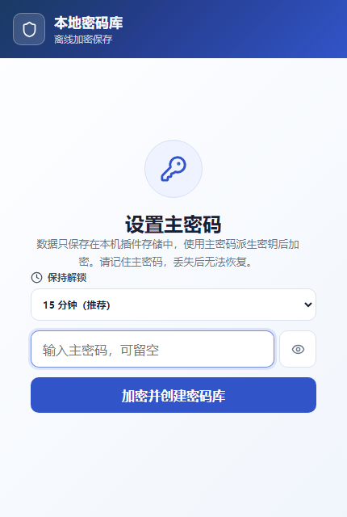
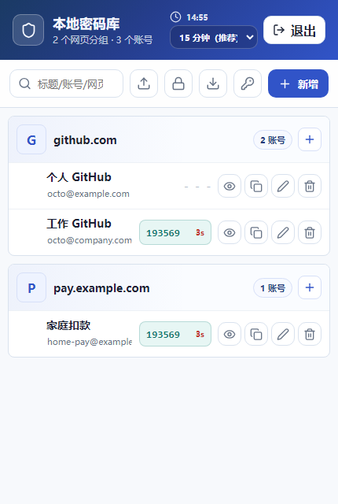
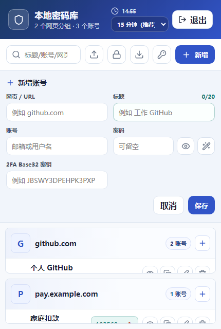
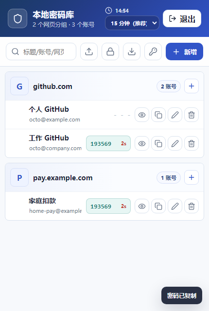

# 本地密码库 Chrome 插件原型

这是从单页 React 原型转换来的 Manifest V3 Chrome 插件。原始文件 `code_artifact (1).tsx` 已保留，插件工程代码在 `src/`、`public/` 和构建配置文件中。

## 实现思路

- 主密码库使用主密码通过 PBKDF2-HMAC-SHA256 派生 AES-GCM 256 位密钥，加密后保存到 `chrome.storage.local`。
- 新建密码库使用 600,000 次 PBKDF2 迭代；旧密码库按加密对象内记录的迭代数解锁。
- 加密备份导出为 `encrypted_backup` JSON，备份内容再次使用当前主密码加密，不包含账号、密码、TOTP 明文。
- 加密备份导入会自动识别 schema，使用当前主密码解密并合并；旧明文 JSON/CSV 仍兼容。
- 账号记录包含 `title`、`website`、`username`、`password`、`twoFactorSecret` 等字段；`title` 是 20 个字符以内的账号标题，用于区分同一网页下的多个账号。
- 旧密码库或旧导入文件没有 `title` 时，会自动用账号或网页生成兜底标题，解锁后可继续编辑保存。
- 短时会话支持：本次弹窗、5 分钟、15 分钟、30 分钟、60 分钟，默认 15 分钟。
- 短时会话只放在 background service worker 的内存中，不写入 storage。浏览器回收 service worker 或扩展进程重启后，会话会失效，需要重新输入主密码。

## UI 风格

- 整体是安全工具型产品界面：克制、紧凑、偏工作流，不做营销式首页。
- 视觉继承原型的蓝靛色安全感，用浅灰蓝背景、白色表面、危险/提示色做辅助。
- 信息结构保持插件弹窗友好：顶部状态栏、会话时长选择、搜索与导入导出工具栏、内联新增/编辑面板、按网页分组的账号列表。
- 网页 / URL 只在分组头展示；账号行展示账号标题、账号名、2FA 验证码和操作按钮，避免同一网页下多账号时重复显示网页。
- 明文密码和 2FA 密钥默认隐藏。加密导出是默认导出入口，明文导出保留为带确认的辅助入口。

## 项目截图

以下截图来自 `npm run dev -- --host 127.0.0.1 --port 5173` 启动后的真实页面。









## 加载插件

```bash
npm install
npm run build
```

然后在 Chrome 中打开 `chrome://extensions`，开启“开发者模式”，选择“加载已解压的扩展程序”，目录选择：

```text
C:\Users\zhuxuan\Desktop\密码库\local-vault-chrome-extension\dist
```

开发调试页面：

```bash
npm run dev -- --host 127.0.0.1 --port 5173
```

## 验证

```bash
npm run typecheck
npm test
npm run build
```

当前测试覆盖：

- 主密码库加密/解密、错误主密码、复用 salt 写入。
- 加密备份导出不含明文、错误密码拒绝、schema 校验。
- JSON/CSV 导入解析、标题字段兼容与 20 字截断、带逗号 CSV、导入记录重新分配 ID。
- 短时会话选项、默认推荐项、未过期恢复、过期清理。
- RFC 6238 TOTP 测试向量、Base32 兼容输入、错误密钥。
- 密码生成与 TOTP 密钥格式校验。
- `chrome.storage.local` 不可用时的本地存储回退。

## 安全说明

- 短时会话为了支持免输主密码，会在 background service worker 内存中保留账号明文和主密码，直到到期或手动锁定。
- 这份短时会话不会写入 `chrome.storage.local`、`chrome.storage.session` 或 `localStorage`。
- 由于 MV3 service worker 会被 Chrome 回收，短时会话可能早于选择的分钟数失效。这是安全模型的一部分。
- 真正上线前仍需要做威胁建模、依赖审计和扩展商店权限审查。
